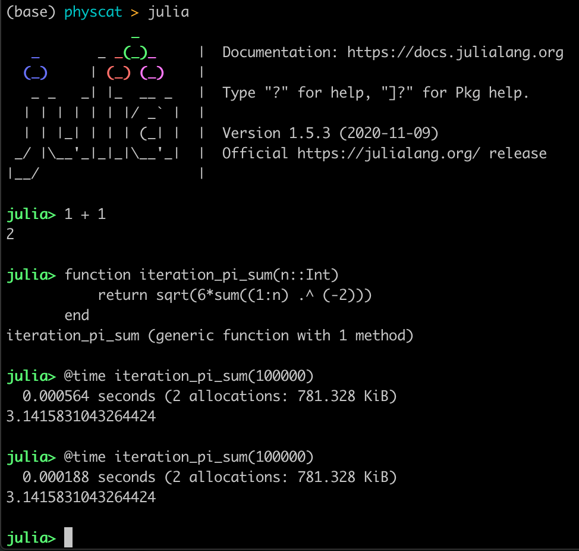
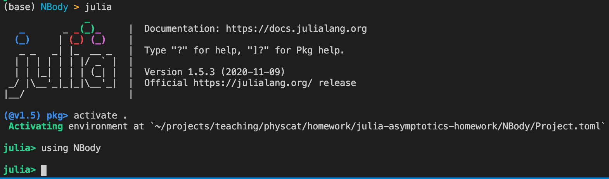

This homework is due on 6 April 2021. Please create a GitHub repository for this homework (as detailed below) and submit to Gradescope via Github.

## Part 1: Setup

Time budget: 1.5 hours.

For this homework, we'll need to install Julia and Git, and make a Github account. Note that we plan to discuss how Git and Github work in more detail in a later lecture; for now, we'll list the commands you should use. If you have questions, you can come to OH, or refer to the [Git Cheat Sheet](https://www.atlassian.com/git/tutorials/atlassian-git-cheatsheet).

Download the latest version of Julia [here](https://julialang.org/downloads/). This should be v1.5.4, but any v1.x should work fine. Once it's installed, you should be able to run `julia` from your command line, which will open an interface that looks something like this:



Next, download [Git](https://git-scm.com/downloads) and make sure you can use it via the command line. Windows users may have to use Git Bash as their terminal, which should download along with the Windows installation of Git.

Finally, go to [GitHub](https://github.com/) and make an account if you don't already have one. 

You're now ready to get the code for this homework! Move into a directory you want to use for the homework, and run the following line in your terminal:

```
git clone https://github.com/physcatdecal/physcat-hw4-nbody
```

You should now have a folder called `physcat-hw4-nbody` containing the starter code. You can open this up in your favorite text editor

To keep track of your work, go to GitHub and make a new *private* repository, also called `physcat-hw4-nbody`. Follow its instructions to "push an existing repository from the command line":

```
git remote add origin https://github.com/<your-username-here>/physcat-hw4-nbody.git
git branch -M main
git push -u origin main
```

If you go to `github.com/<your-username-here>/physcat-hw4-nbody`, you should now see your version of the same repository. As you work, be sure to periodically "commit" (permanently save) and "push" (send to Github) your code to this repository, by running

```
git add * 
git commit -m "Description of changes goes here."
git push origin main
``` 

If you'd like to only update some files, put those files' names instead of the `*` in `git add *`. Also, try and make the messages in `git commit` as helpful as possible!

## Part 2: N-Body Integration and Asymptotics

Time budget: 4.5 hours.

This homework is a slight jump in two ways: we're using Julia, and we're no longer working in `.ipynb`s. 

### Julia

Julia syntax is a lot like Python, but there's some important changes:

- Julia needs all functions, loops, and conditionals to end with the `end` keyword, and indentation doesn't matter.
- Instead of a Python `range(start, stop, step)`, Julia has the `start:step:stop` StepRange object. You can create an array out of a range using the `collect` function.
- To operate on a whole array at once, Julia has the dot-vectorize operator, e.g. `sqrt.([1, 4, 9])` returns `[1.0, 2.0, 3.0]`. This also applies to addition, multiplication, etc., and can be used on range objects too: `(1:3) .+ 6` returns `7:9`.
- The carat (`^`) is exponentiation, and `**` isn't anything. (I forget about this a lot!)

On the other hand, here's some things that still work:

- `enumerate`
- List comprehensions
- `return`

It's very possible that I've forgotten something because I'm used to it already, though, so feel free to reach out for help!

### Source Files and Running Your Code

The format of working directly on source files may be strange at first. However, this is how most real science/coding projects will work, and also how we'll expect most projects to be done - hopefully this homework will serve as a good reference for how to structure those! 

To run your code, do the following:

1. In your terminal, `cd` into the `NBody` directory.
2. Open Julia.
3. Type the `]` key, and you should get a prompt saying something like `(@v1.5) pkg>`. Type `activate .` (with the dot).
4. You should now see the prompt `(NBody) pkg>`. The first time you do this, type `instantiate` and wait - this may take a while as it fetches all the packages we need.
5. Backspace out to the regular Julia REPL and type `using Revise`. This makes it so that as you change the codebase, you won't have to keep reimporting NBody.
6. Now, type `using NBody`.

(Note that it's possible to automate using Revise as soon as you sart Julia, which you do by making a file at `~/.julia/config/startup.jl` which has only the line `using Revise` in it. I have this, so you may want to consider it too!)

All this sounds like a lot of steps, but after the first time you do it, it's not much - it should look like this:



You can now run all the code in the `NBody` package - try `names(NBody)` to see everything you have now!

To run tests, use the command `include("test/test_setup.jl")` or the equivalent for `test_solve.jl`. `runtests.jl` runs both files together. `include` does not automatically revise its source, so if you edit the tests (which you shouldn't have to for this assignment) you'll need to run `include` again.

### Code Tasks

Fill in the functions marked `# YOUR CODE HERE` in `setup.jl` and `solve.jl`. We'll write the setup and a solver for the N-body problem (calculating the motion of bodies that interact according to an inverse-square law), and compare their accuracy and performance. Specifically,

- complete the function `inverse_square_diffeq` in `src/setup.jl`, to calculate interactions between each pair of bodies
- complete the function `euler` in `src/solve.jl`, to carry out Euler integration on a differential equation

After that, follow the instructions in `earth_sun.jl` to make a plot of the Earth-Sun system interacting gravitationally. 

If you're interested, try adding in a third body, like Jupiter - this isn't required because this assignment's likely already stretching the time budget, but it's a lot of fun to try different initial setups. See "@ThreeBodyBot" on Twitter! (We may also look at the physics of this more on Homework 5.)

### Written Questions

Once you're done, open up `questions.md` in your favorite text editor, and briefly answer the following questions:

- As a function of the number of bodies, give an asymptotic (theta) bound on the runtime of `inverse_square_diffeq`.

- What was weird about the plot we got in earth_sun.jl?

- Suggest some ways we could improve this. There's no wrong answers here! We don't need a specific algorithm - just whatever you think about which parts could be made more efficient, or use something we know from physics.

Submit your work by committing and pushing to your Github, and submitting that to Gradescope.

